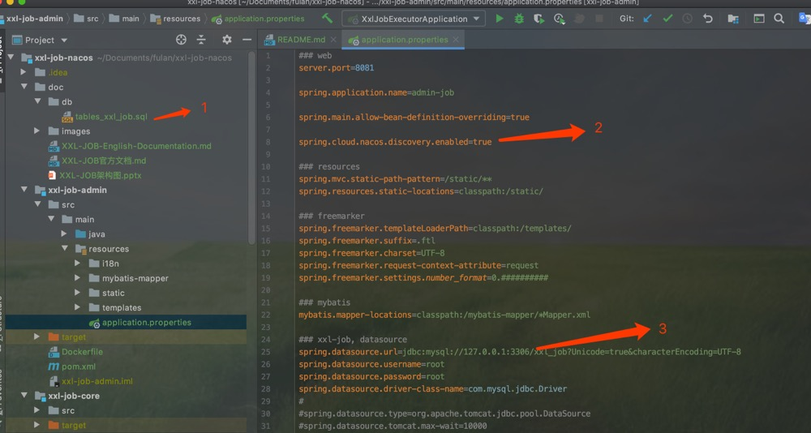
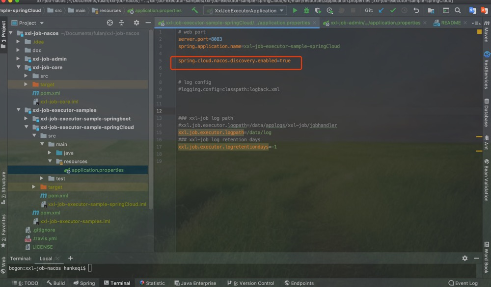

# xxl-job-nacos

#### 介绍
基于 `xxl-job version-2.2.1` 改造服务注册中心实现服务自动发现的分布式定时任务
删除了 netty

#### 编写背景
> 为解决公司项目微服务拆分下带来的netty端口管理问题，采用基于注册中心实现的自服务发现进行调度。目前已支持nacos，下一版本支持eureka

#### 软件架构


#### 软件环境
````
1. JDK1.8+
2. springboot1.5x+ | springboot2.x+
````

#### 使用说明
1. 导入数据库sql
2. 根据需要修改对应properties属性
3. 输入网页地址 `http://ip:port` 



4. 根据需要修改测试用例属性 将示例执行器启动



5. 调度中心新增执行器 30s内`执行器`会自动发现`调度器`, `TODO 无需手动`


##
感谢原作者 `xuxueli`
##

#### 联系方式
如有疑问可直接添加微信 `h_anke`

